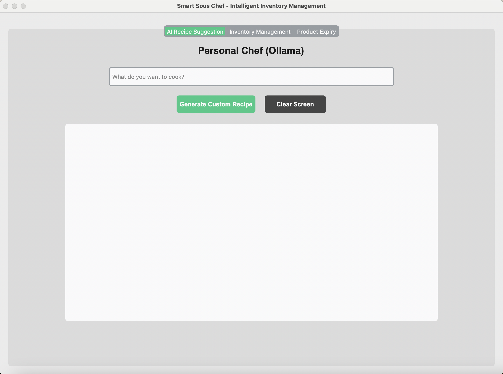
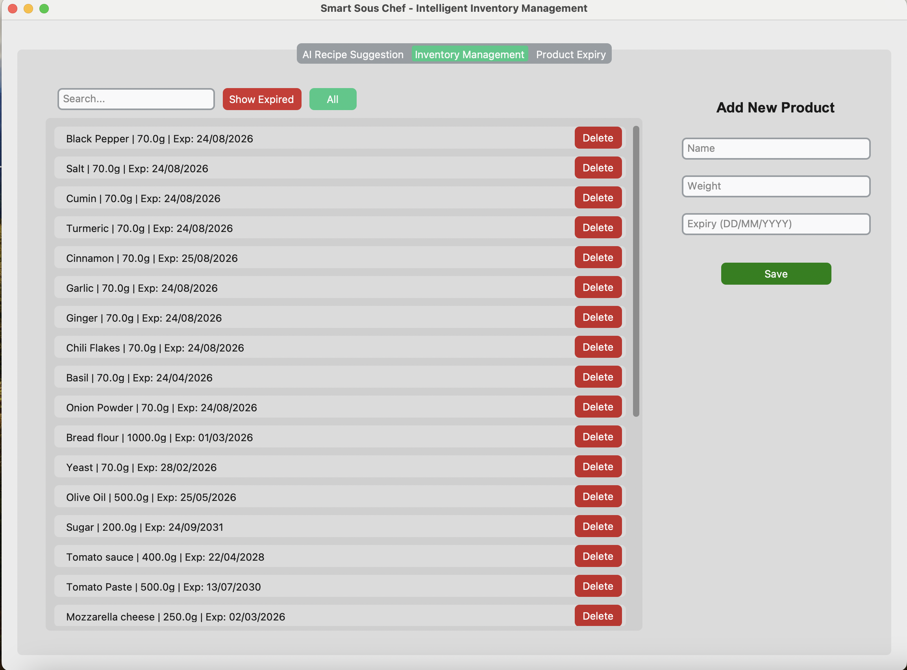
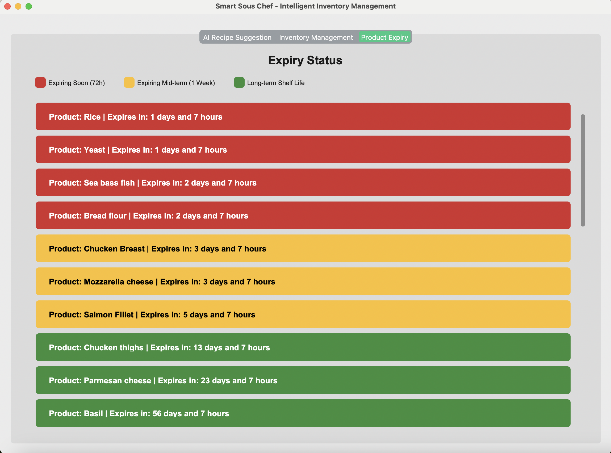

🍳 SmartSousChef - AI Driven Kitchen & Inventory Manager
Final Project | Object-Oriented Programming & Python The College of Management Academic Studies (Colman)

📖 Overview
SmartSousChef is a modular desktop application designed to manage kitchen inventory and leverage Local AI to minimize food waste. The system tracks product expiration dates and uses a Large Language Model (LLM) to generate recipes based on the user's actual stock.

🏗 Architecture & Design Patterns
The project strictly implements the MVC (Model-View-Controller) architectural pattern to ensure Separation of Concerns (SoC) and high maintainability.

Model (models/): Manages data persistence with SQLite. It handles the product entities and database logic independently.

View (views/): A modern Graphical User Interface (GUI) built with customtkinter. It manages user interactions and data presentation.

Controller (controllers/): The brain of the application (MainController.py). It processes user input, coordinates between the Model and View, and manages Asynchronous AI Inference.

🖥 System Modules & Interface
The application is divided into several functional screens, each serving a specific goal:

1. AI Recipe Generator (Main Screen)

The core innovation of the project.

Input: Users enter free-text requests (e.g., "Make me something Italian").

Process: The system sends the current inventory as context to the Ollama LLM via a dedicated background thread to keep the UI responsive.

Output: A customized recipe is displayed, prioritizing ingredients available in the kitchen.

2. Product Management (Add/Edit)

A dedicated interface for data entry and CRUD operations.

Validation: Includes real-time validation for data types, positive weights, and date formats (DD/MM/YYYY).

UX: Implements Debounced Search, allowing users to filter the inventory instantly without lagging the interface during database queries.

3. Inventory Dashboard (Expiry Status)

Real-time tracking of kitchen products with visual alerts.

Traffic Light System:

🔴 Red: Expiring within 72 hours.

🟡 Yellow: Nearing expiration (up to 1 week).

🟢 Green: Fresh/Long shelf life.

🧠 Key Academic Concepts Applied
The project demonstrates a deep integration of professional software engineering principles as required by the course curriculum:

Modularity & MVC Pattern: The application is strictly partitioned into independent modules based on their roles. Each entity (e.g., Product, DatabaseManager) is encapsulated in its own file to ensure low coupling and high maintainability.

Encapsulation & Information Hiding: Classes expose only the necessary methods through a clean interface. Internal data states, such as the direct SQLite connection strings or private attributes, are shielded within their respective classes.

Vertical Inheritance: The system demonstrates inheritance by extending the customtkinter.CTk framework. The KitchenGUI class inherits and specializes all GUI behaviors.

Data Persistence (SQLite): A local relational database is used for persistent storage. The system handles full CRUD operations, ensuring that data is correctly saved and retrieved across application restarts.

Event-Driven REPL Logic: While implemented as a modern GUI, the system follows a logical REPL (Read-Eval-Print Loop) pattern. The mainloop continuously waits for user events (Read), processes them through the Controller/AI (Eval), and updates the interface in real-time (Print).

Advanced Pythonic Implementations:

Dunder Methods: Use of __init__ for lifecycle management and __repr__ for technical debugging and object representation.

Decorators: Extensive use of @property for "Live Fields" (e.g., calculating the remaining shelf life of a product on the fly).

Local AI Integration: The project features a sophisticated implementation of a local AI service via Docker. This module handles complex natural language processing tasks based on inventory context.

Concurrency (Threading): To maintain a professional User Experience, heavy tasks like AI inference are offloaded to background threads. This prevents the GUI from "freezing" (Non-blocking UI).

🤖 AI Integration
Local Inference: Connected to a local Ollama server running via Docker for privacy and offline capability.

Context-Aware: The controller injects the SQLite inventory into the AI prompt to ensure the LLM provides realistic suggestions based on real-time stock.

🛠 Tech Stack
Language: Python 3.10+

Database: SQLite

GUI: CustomTkinter

AI Engine: Ollama (Llama 3)

Infrastructure: Docker

🚀 How to Run
Clone the repository.

Install Dependencies:

Bash
pip install customtkinter requests
Setup AI Environment:

Bash
docker-compose up -d
docker exec -it ollama_container ollama pull llama3
Execute:

Bash
python main.py
